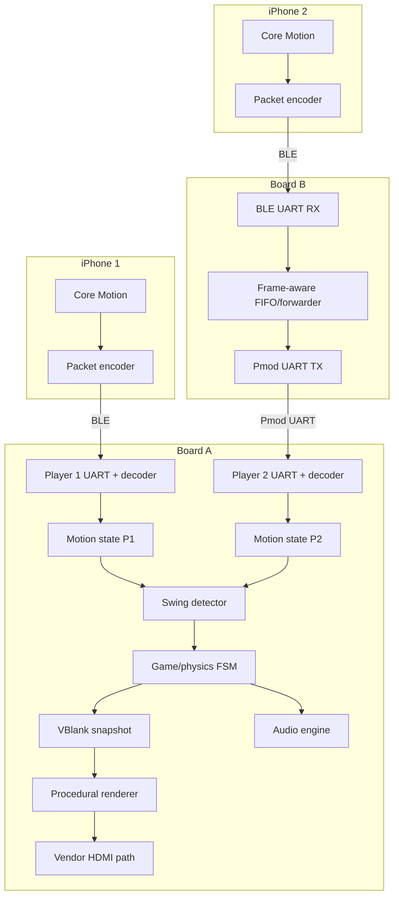

# System and RTL Architecture

This document is required reading for every implementation track. It defines module boundaries, clock-domain behavior, data contracts, and the intended repository layout. `plan.md` is authoritative for parallel file ownership and merge gates.

## 1. System ownership

### Board A — main game board

- Receives Player 1 motion from its onboard BLE UART.
- Receives Player 2 motion from Board B over Pmod UART.
- Decodes, validates, timestamps, and monitors both input streams.
- Detects swing events.
- Runs the authoritative game, physics, scoring, projection, and animation state.
- Publishes a frame-consistent state snapshot to the video domain.
- Generates the 720p raster and feeds the vendor HDMI path.
- Generates audio events and waveforms.
- Sends optional feedback events to Board B and both phones.

### Board B — controller gateway

- Receives Player 2 motion from its onboard BLE UART.
- Buffers and forwards framed bytes over Pmod UART.
- Exposes link health through LEDs/debug counters.
- Receives optional feedback events from Board A and forwards them to the onboard BLE UART.
- Does not run physics, scoring, or video.

## 2. Data flow



## 3. Clock and reset plan

| Domain | Nominal frequency | Responsibilities |
|---|---:|---|
| `clk_sys` | 100 MHz | UARTs, packet parsing, controller health, swing logic, 60 Hz game enable, audio control |
| `clk_pix` | 74.25 MHz | 1280×720 raster timing, sprite reads, compositing |
| HDMI high-speed clock | Vendor-defined, typically 5× pixel clock | Used only inside or as required by the vendor HDMI IP |

Rules:

- Generate video clocks with a Vivado clocking primitive/configured Clocking Wizard consistent with the Real Digital reference design.
- Synchronize each reset deassertion into its destination domain. Assertion may be asynchronous; deassertion must be synchronous.
- Run gameplay in `clk_sys` using a one-cycle 60 Hz clock-enable pulse. Do not create a fabric-divided game clock.
- UART is asynchronous by design. Each receiver oversamples or uses a center-sampling baud tick derived from its local clock.
- Cross game state into `clk_pix` with an atomic snapshot handshake during vertical blank. Do not independently synchronize a large set of changing buses.
- Keep HDMI serializer/high-speed details within the vendor-supported boundary.

## 4. Frame-consistent state publication

The game engine writes a packed `game_render_state_t` in the system domain. Once per video frame:

1. The video domain raises a `vblank_request` toggle.
2. The system domain sees the synchronized toggle and copies the current render state into a stable shadow bank.
3. The system domain toggles `snapshot_ready`.
4. The video domain synchronizes that toggle and captures the complete shadow bank before active video resumes.

The shadow bank must remain stable until the next request. This avoids tearing without a framebuffer. A dual-clock mailbox or small dual-port RAM may be used if the packed state becomes too wide.

## 5. Suggested repository layout

```text
fpga-motion-tennis/
├── README.md
├── STATUS.md
├── status/
│   ├── ios.md
│   ├── transport.md
│   ├── video.md
│   ├── gameplay.md
│   └── integration.md
├── docs/
│   ├── hardware-manifest.md
│   ├── protocol.md
│   └── bringup-log.md
├── config/
│   ├── board_a.xdc
│   ├── board_b.xdc
│   └── generated-ip-notes.md
├── rtl/
│   ├── common/
│   │   ├── reset_sync.sv
│   │   ├── tick_gen.sv
│   │   ├── uart_rx.sv
│   │   ├── uart_tx.sv
│   │   ├── sync_fifo.sv
│   │   ├── crc16_ccitt.sv
│   │   ├── frame_unescaper.sv
│   │   └── motion_packet_decoder.sv
│   ├── bridge/
│   │   ├── frame_forwarder.sv
│   │   └── board_b_top.sv
│   ├── game/
│   │   ├── controller_health.sv
│   │   ├── swing_detector.sv
│   │   ├── ball_physics.sv
│   │   ├── tennis_rules.sv
│   │   ├── game_engine.sv
│   │   └── render_state_mailbox.sv
│   ├── video/
│   │   ├── video_timing_720p.sv
│   │   ├── perspective_projector.sv
│   │   ├── court_renderer.sv
│   │   ├── net_renderer.sv
│   │   ├── sprite_renderer.sv
│   │   ├── font_rom.sv
│   │   ├── ui_renderer.sv
│   │   ├── pixel_compositor.sv
│   │   └── video_pipeline.sv
│   ├── audio/
│   │   ├── tone_voice.sv
│   │   ├── audio_mixer.sv
│   │   └── pwm_audio_out.sv
│   ├── packages/
│   │   ├── protocol_pkg.sv
│   │   ├── game_types_pkg.sv
│   │   └── video_types_pkg.sv
│   └── board_a_top.sv
├── sim/
│   ├── common/
│   ├── game/
│   ├── video/
│   └── vectors/
├── assets/
│   ├── sprites/
│   ├── fonts/
│   └── generated_mem/
├── scripts/
│   ├── build_assets.py
│   └── run_sim.sh
└── ios-controller/
    ├── MotionTennisController.xcodeproj/
    └── MotionTennisController/
        ├── BLEManager.swift
        ├── MotionSampler.swift
        ├── MotionPacket.swift
        ├── ControllerViewModel.swift
        └── ContentView.swift
```

Track agents must retain these boundaries and the ownership table in `plan.md`. Generated Vivado output should not be committed indiscriminately; record the exact Vivado version and reproducible IP-generation steps.

### Parallel integration seams

The interface-freeze stage creates compiling packages and module stubs at every cross-track seam:

- Transport publishes validated `motion_sample_t` values plus health counters.
- Gameplay consumes `motion_sample_t` and publishes `game_render_state_t` plus audio events.
- Video consumes only `game_render_state_t`; scripted test-state generation is local to the video testbench/top.
- Integration wires those seams in top-level modules without moving logic across ownership boundaries.

Before F0, interfaces may change freely under the freeze owner. After F0, a track may extend an interface only through a reviewed, versioned contract change recorded in every affected status file. Private internal types remain under their track owner.

## 6. Key SystemVerilog types

Define shared packed types in packages rather than duplicating fields.

```systemverilog
typedef struct packed {
    logic        valid;
    logic        stale;
    logic [15:0] sequence;
    logic [31:0] phone_time_ms;
    logic signed [15:0] accel_x;
    logic signed [15:0] accel_y;
    logic signed [15:0] accel_z;
    logic signed [15:0] gyro_x;
    logic signed [15:0] gyro_y;
    logic signed [15:0] gyro_z;
    logic signed [15:0] quat_w;
    logic signed [15:0] quat_x;
    logic signed [15:0] quat_y;
    logic signed [15:0] quat_z;
} motion_sample_t;

typedef struct packed {
    logic        valid;
    logic        forehand;
    logic        upward;
    logic [15:0] strength;
    logic signed [15:0] aim_x;
    logic signed [15:0] lift;
} swing_event_t;
```

`game_render_state_t` should contain only display-facing values: projected/player animation state, ball world or screen coordinates, score, connection indicators, and event meters. Do not expose internal physics implementation details to the renderer.

## 7. Top-level module intent

### `board_b_top.sv`

```text
BLE RX pin
  → uart_rx
  → frame_forwarder / FIFO
  → uart_tx
  → selected Pmod TX pin

selected Pmod RX pin
  → uart_rx
  → return forwarder
  → uart_tx
  → BLE TX pin
```

### `board_a_top.sv`

```text
BLE RX → UART/parser P1 ┐
                        ├→ controller state → swing detector → game engine
Pmod RX → UART/parser P2┘                              │
                                                     ├→ audio engine
                                                     └→ render-state mailbox
                                                               ↓
pixel timing → layer renderers → compositor → vendor VGA-to-HDMI path
```

Keep Board A's top module structural. It should instantiate and connect subsystems, not contain parsers, physics, or large rendering expressions.

## 8. Transport contract

All phone motion packets and board-to-board packets use the same escaped frame. The raw payload is 32 bytes:

| Offset | Size | Field | Encoding |
|---:|---:|---|---|
| 0 | 1 | Protocol version | `0x01` |
| 1 | 1 | Message type | `0x01` for motion |
| 2 | 1 | Player ID | `0x01` or `0x02` |
| 3 | 1 | Flags | Bit 0 calibrated; remaining bits reserved |
| 4 | 2 | Sequence | Unsigned little-endian |
| 6 | 4 | Phone timestamp | Milliseconds modulo 2³², little-endian |
| 10 | 6 | Acceleration XYZ | Three signed little-endian `int16`, g × 4096 |
| 16 | 6 | Gyroscope XYZ | Three signed little-endian `int16`, rad/s × 512 |
| 22 | 8 | Quaternion WXYZ | Four signed little-endian `int16`, value × 32767 |
| 30 | 2 | CRC | CRC-16/CCITT-FALSE over bytes 0–29, stored little-endian |

Framing rules:

- `0x0A` is the frame terminator required by the stock BLE-UART behavior.
- `0x7D` is the escape byte.
- Before transmission, raw `0x0A` becomes `0x7D 0x2A` and raw `0x7D` becomes `0x7D 0x5D`; equivalently, send the escape byte followed by the raw byte XOR `0x20`.
- Append one unescaped `0x0A` terminator.
- Reject invalid length, unsupported version/type, invalid player ID, or bad CRC.
- Reset parser state cleanly after every terminator, overflow, timeout, or framing error.

This byte-stuffing rule is mandatory. Raw binary followed by newline is unsafe because any sensor byte may itself equal `0x0A`.

## 9. Video composition order

Use a deterministic priority compositor, highest priority first:

1. Text and status UI.
2. Ball and optional short trail.
3. Near-player sprite and racket.
4. Net foreground portions.
5. Far-player sprite and racket.
6. Net/background portions.
7. Court lines.
8. Court surface and outside area.
9. Stadium/crowd background.

Every layer emits `{valid, palette_index_or_rgb}` for the current pipelined coordinate. Align all layer-valid signals to the same latency before composition.

## 10. Coding and verification rules

- Use `always_ff` for sequential logic and `always_comb` for combinational logic.
- Use nonblocking assignments in sequential blocks.
- Define default assignments in combinational blocks to prevent inferred latches.
- Use explicit signed declarations and casts around fixed-point arithmetic.
- Saturate sensor conversions and physics state instead of relying on wraparound.
- Parameterize clock frequency and baud rate; verify generated divisors at elaboration where possible.
- Avoid asynchronous inputs feeding ordinary logic; UART pins enter only through the receiver front end.
- Add counters for received frames, CRC errors, framing errors, sequence gaps, FIFO overflow, and stale events.
- Unit-test pure modules independently. Run lint/elaboration before behavioral simulation.
- Do not optimize away observability until hardware bring-up is complete.
