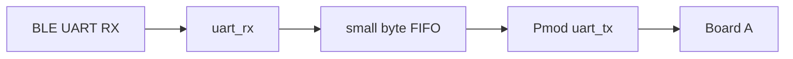

# Phase 2 — Board-to-Board Pmod UART

## Objective

Connect the two Boolean Boards so Board B forwards Player 2 frames to Board A while Board A continues receiving Player 1 directly. Prove stable simultaneous transport before adding gameplay.

## Physical wiring

The installed Pmod/Pmod+ sockets are female, so use male-to-male 0.1-inch jumper wires.

| Board A | Board B | Purpose |
|---|---|---|
| Selected Pmod `RX` GPIO | Selected Pmod `TX` GPIO | Player 2 motion toward Board A |
| Selected Pmod `TX` GPIO | Selected Pmod `RX` GPIO | Feedback/status toward Board B |
| Pmod `GND` | Pmod `GND` | Common signal reference |

Safety rules:

- Do not connect the boards' `3V3`, `5V`, or USB power rails.
- Power each board normally by USB.
- Select exact signal and ground positions from the official XDC/schematic.
- Record connector name, header position, FPGA package pin, I/O bank, and I/O standard in `docs/hardware-manifest.md`.
- Configure GPIO as `LVCMOS33` only after confirming the board design uses 3.3 V on that connector.
- Cross TX and RX. Never configure both ends of one wire as outputs.

## Board B forwarding design

Board B should remain simple and byte-transparent:

- Forward the complete escaped wire frame, including its terminating newline.
- Do not decode and re-encode ordinary Player 2 motion frames on Board B.
- Use a small FIFO, initially 128 bytes or greater, between the two UARTs.
- Count input bytes, output bytes, complete frames, FIFO high-water mark, and overflow.
- A malformed frame may still be forwarded; Board A is the authoritative validator. Board B may count delimiters for debug visibility.
- Both serial links start at 115,200 baud. Keep baud parameters independent so later changes do not require module rewrites.

For the reverse direction, implement the symmetrical Pmod-RX → FIFO → BLE-UART-TX path. It need not carry gameplay feedback until Phase 5, but proving the electrical/full-duplex path now reduces integration risk.

## Board A receive integration

Board A has two independent receive chains:

- BLE UART parser configured to accept Player ID 1.
- Pmod UART parser configured to accept Player ID 2.

Do not multiplex bytes from both sources into one parser. Independent parsers eliminate interleaving and preserve per-link error counters. Their validated `motion_sample_t` outputs update separate controller-state registers.

Add a compact debug/status register bank containing:

- Valid-frame counts per player.
- Last sequence per player.
- Sequence gaps per player.
- CRC/framing/length failures per input.
- Stale flags and time since last valid sample.
- Board B FIFO overflow/high-water information if returned through a debug event.

## Bring-up sequence

1. Program Board A with a Pmod UART receiver that displays a received test counter.
2. Program Board B with a local repeating test-frame generator feeding Pmod UART.
3. Connect only `Board B TX → Board A RX` and common ground.
4. Confirm reliable one-way traffic before connecting the reverse wire.
5. Connect the reverse UART and verify Board A can send a test event back to Board B.
6. Replace Board B's test generator with BLE-frame forwarding.
7. Connect Phone 2 to Board B and verify decoded Player 2 motion on Board A.
8. Connect Phone 1 to Board A and stream both phones simultaneously.

This staged sequence isolates pin mapping and UART electrical errors from BLE/application errors.

## Simulation requirements

- FIFO preserves byte order under small rate mismatch and bursty input.
- FIFO never reads empty or writes full without setting the expected status.
- Back-to-back worst-case escaped frames pass intact.
- UART endpoints tolerate independent local clocks within expected oscillator tolerance.
- Board A's two parsers update only their assigned player.
- Sequence/stale counters remain independent.
- Reverse feedback traffic does not block forward motion traffic because it uses a separate wire/UART direction.

## Checkpoint C2 — pass criteria

1. Connect Phone 1 to Board A and Phone 2 to Board B.
2. Stream both at 50 Hz for five continuous minutes.
3. Move the phones independently and verify that Board A never swaps player identity.
4. Temporarily disconnect or stop one phone and verify only that controller becomes stale within 250 ms.
5. Reconnect and verify automatic recovery without reprogramming either FPGA.
6. Record frame counts, sequence gaps, CRC errors, UART framing errors, FIFO high-water mark, and FIFO overflow.

C2 passes when:

- Board A continuously holds fresh, independent motion state for both players.
- Each player retains at least 99.5% observed frame delivery during the stable portion of the run.
- There are no FIFO overflows or persistent framing failures.
- Stale/recovery behavior works independently.
- Full-duplex test traffic succeeds.
- Exact wiring and XDC assignments are documented.

After C2, freeze the motion wire protocol unless a demonstrated gameplay need requires a versioned change.

