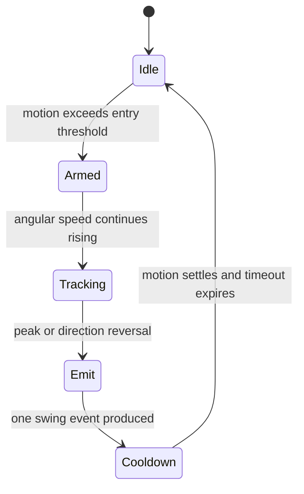

# Track — Swing Recognition and Tennis Gameplay

## Objective

Turn validated motion samples into discrete racket swings and build a deterministic, testable fixed-point tennis simulation. Develop against recorded/synthetic sensor vectors first, then tune with hardware while reusing the stable transport and video paths.

This track starts after F0 and does not wait for BLE, board-link, or HDMI hardware. Consume frozen `motion_sample_t` fixtures and validate `game_render_state_t` output in simulation.

## Ownership and handoff

This track owns `rtl/game/`, `rtl/audio/`, `sim/game/` (including gameplay vectors), and `status/gameplay.md`. Integration consumes its audio-event and synthesizer interfaces. Do not edit transport, video, shared packages, or Board A top-level files.

## Gameplay model

The avatars move automatically into plausible hitting positions. The player controls the shot through:

- Swing timing relative to ball arrival.
- Swing direction or forehand/backhand classification.
- Peak acceleration/angular velocity, mapped to bounded strength.
- Upward/downward component, mapped to lift.
- Phone orientation at impact, mapped to left/right aim and optional spin.

This preserves the motion-tennis experience without pretending the phone provides absolute court position.

## Coordinate and numeric model

Use signed 32-bit fixed-point values, initially Q16.16, for world position and velocity. Revisit only after range/error analysis.

Suggested world axes:

- `x`: horizontal across the court.
- `y`: distance from near baseline toward far baseline.
- `z`: height above court.

Gameplay runs on a 60 Hz enable in the 100 MHz system domain. Constants such as gravity, bounce restitution, drag, court dimensions, net height, and racket reach are fixed-point parameters with units documented in `game_types_pkg.sv`.

Use wider intermediates for multiply/accumulate and explicit rounding/saturation when returning to Q16.16.

## Swing detector

### State machine

Maintain a short rolling window, initially 8–16 samples at 50 Hz. Derive:

- Acceleration magnitude or bounded energy proxy.
- Angular-speed magnitude.
- Dominant rotation axis/sign.
- Peak values and time-to-peak.
- Orientation quaternion near peak.
- Upward component in a calibrated/controller-relative frame.

Requirements:

- Emit at most one `swing_event_t` per physical swing.
- Suppress small movements and phone repositioning.
- Use hysteresis between entry and release thresholds.
- Include a configurable cooldown.
- Ignore or cancel events when the controller is stale or uncalibrated.
- Put thresholds in a centralized tuning package/register bank, not magic numbers throughout the module.

Begin with forehand/backhand or left/right classification. Spin is optional until the basic game is reliable.

## Physics modules

### `ball_physics.sv`

- Integrates position/velocity once per game tick.
- Applies gravity to `z`.
- Detects court crossing and bounce.
- Applies bounded restitution and optional simple drag.
- Reports net-plane crossing and current height at the net.
- Produces in-bounds/out-of-bounds and stopped-ball events.

### Racket interaction

- Each avatar has an automatically selected horizontal position and a bounded hit window.
- A swing only contacts the ball when its event overlaps the temporal/spatial hit window.
- Map timing error to shot direction/quality.
- Map strength and lift to outgoing velocity within safe minimum/maximum limits.
- Once contact occurs, lock out repeat collision for that swing/ball crossing.

### `tennis_rules.sv`

- Own serve side/player, fault/serve state, rally ownership, bounce count, point/game score, and match reset.
- Implement conventional `0, 15, 30, 40, game`; deuce/advantage may be included in the MVP if tests are complete.
- Keep rules separate from ball math so scoring can be tested with event sequences.

### `game_engine.sv`

- Coordinates match FSM, physics, swing events, avatar animation state, sound events, and render-state production.
- Does not parse UART bytes or generate pixels.

## Deterministic verification

Create reusable sensor and game traces:

- Idle/noise trace produces no swing.
- One forehand produces exactly one event.
- One backhand produces exactly one event.
- Slow repositioning produces no event.
- Two distinct swings separated by cooldown produce two events.
- Stale/un-calibrated controller produces no event.
- Threshold-edge and saturated sensor values remain bounded.

Physics/rules tests:

- Serve enters play.
- Ball clears/fails the net at boundary heights.
- Ball bounces once in/out and produces the correct event.
- Double bounce awards the point correctly.
- Early/late/good swing timing maps deterministically.
- Score progresses through all supported tennis states.
- Fixed-point arithmetic never wraps unexpectedly under maximum shots.
- Identical input traces produce identical game-state traces.

## Hardware tuning procedure

1. First expose raw/calibrated motion magnitudes and detector state on the HDMI debug overlay or ILA.
2. Record several intentional forehands, backhands, serves, small movements, and pauses from multiple users.
3. Tune entry/release thresholds and cooldown against the recordings.
4. Validate that a strong but safe swing saturates gracefully.
5. Only then tune shot-speed/lift mappings and hit windows.

Do not tune by changing many constants simultaneously. Record the threshold set and test result after each meaningful revision.

## Gate G1 — gameplay simulation readiness

- All swing and gameplay unit tests pass.
- Recorded traces classify intentional swings reliably without frequent double triggers.
- A single-player hardware rally against a deterministic/simple AI or scripted opponent is playable using one phone.
- Game state publishes clean frame snapshots to the existing renderer.
- No transport/video checkpoint regression occurs.

Record exact test commands/results, trace provenance, interface assumptions, and the gameplay commit in `status/gameplay.md`. G1 is a simulation readiness gate rather than a new formal hardware checkpoint; it must pass before integration consumes gameplay, and its hardware tuning continues toward C4.
