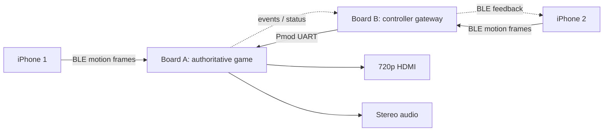
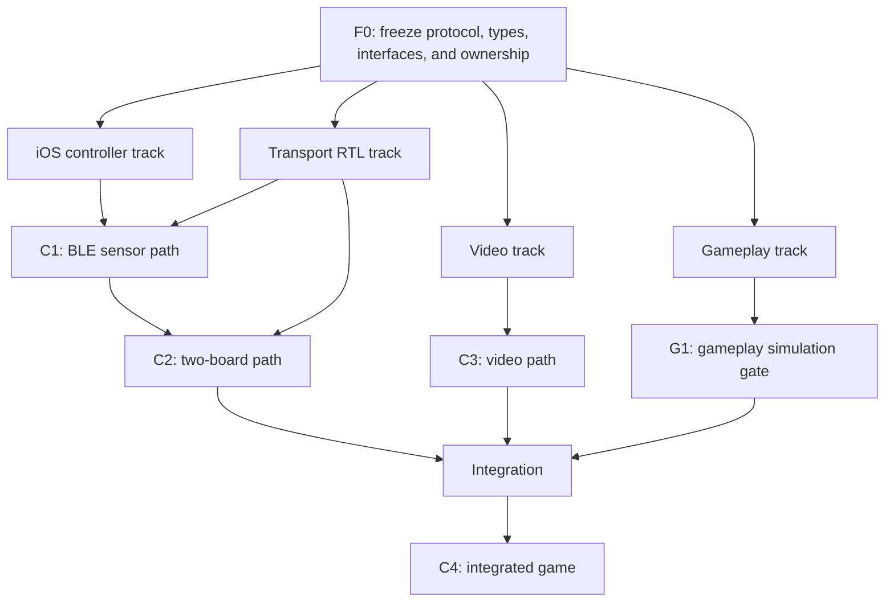

# FPGA Motion Tennis — Master Plan

## 1. Project brief

Build a two-player, motion-controlled, 2.5D tennis game using two Real Digital Boolean Boards and two iPhones.

- Each iPhone reads Core Motion data and sends controller samples over BLE to one Boolean Board.
- Board B acts as the Player 2 BLE-to-UART gateway and forwards Player 2 frames to Board A over a wired Pmod UART link.
- Board A is authoritative: it decodes both controllers, recognizes swings, advances fixed-point tennis physics, renders 1280×720 video, drives HDMI, and generates simple audio.
- The visual target is a polished retro/arcade tennis game: a perspective court, small animated sprites, a net, ball and shadow, score, connection indicators, and a swing-strength meter.

The result is not a general 3D engine and does not attempt absolute phone-position tracking. It is a responsive Wii Tennis–style experience built from motion gestures and procedurally generated 2D graphics.

## 2. Fixed decisions

| Decision | Choice |
|---|---|
| FPGA boards | Two BLE-equipped Real Digital Boolean Boards |
| FPGA | Xilinx/AMD Spartan-7 XC7S50-CSGA324 |
| HDL | Synthesizable SystemVerilog |
| Phone client | Native iPhone app using Swift, Core Motion, and Core Bluetooth |
| Player topology | One iPhone paired to each board |
| Board-to-board link | 115,200-baud full-duplex UART over Pmod GPIO |
| Main board | Board A runs all gameplay, video, scoring, and audio |
| Video target | 1280×720 at 60 Hz using the vendor VGA-to-HDMI path |
| Rendering model | One pixel per pixel clock; procedural layers plus small sprite ROMs |
| Physics | Fixed-point, updated at 60 Hz |
| Motion model | Swing classification; no double integration into absolute position |

## 3. Intended final outcome

Two players can launch the iPhone controller app, connect to their respective boards, calibrate their neutral grip, and swing their phones to serve and return a ball. The near/far avatars move automatically into plausible positions. Swing timing, direction, speed, and orientation influence the shot. Board A displays the match on an HDMI monitor and produces basic hit, bounce, fault, and score sounds.

The final handoff must include:

- Board A and Board B Vivado projects and reproducible bitstreams.
- A Swift iOS controller app that supports Player 1 and Player 2 roles.
- SystemVerilog unit tests for transport, framing, swing detection, physics, scoring, and core render predicates.
- A hardware manifest containing the verified BLE UUIDs, XDC pin assignments, Vivado/IP versions, and physical wiring.
- A short build/run guide and evidence for each key checkpoint.
- A ten-minute two-player demonstration with stable controls, correct scoring, and no visible video instability.

## 4. Scope boundaries

### Required

- Two simultaneous phone controllers through two boards.
- Robust framed sensor transport with sequence numbers and CRC.
- Stable board-to-board forwarding.
- 720p60 2.5D graphics without a full framebuffer.
- Forehand/backhand or left/right swing classification, swing strength, shot timing, ball flight, net/bounds detection, and tennis scoring.
- Basic PWM/PDM audio cues.

### Explicitly out of scope for the MVP

- Photorealistic graphics or arbitrary textured 3D polygons.
- Reconstructing the phone's absolute 3D position from acceleration.
- More than two simultaneous players.
- Reflashing or replacing the stock BLE-module firmware.
- Online multiplayer, accounts, matchmaking, or cloud services.
- A general-purpose CPU or operating system on the FPGA.

## 5. Architecture at a glance

Read [01_architecture.md](docs/01_architecture.md) for clock domains, module boundaries, interfaces, repository layout, and design rules.

## 6. Parallel execution model

Work begins with a short interface-freeze stage. Gate **F0** must pass before implementation tracks edit code. Once F0 passes, four tracks run concurrently; hardware dependencies block only the work that consumes them.

| Stage/track | Purpose | Required reading | Gate |
|---|---|---|---|
| Interface freeze | Lock the shared contracts and create the skeleton | [00_interface_freeze.md](docs/00_interface_freeze.md) | **F0:** Golden vectors, packages, interfaces, ownership, and stubs reviewed |
| iOS controller | Core Motion, Core Bluetooth, Swift encoder, app UX | [02_track_ios_controller.md](docs/02_track_ios_controller.md) | Contributes the phone side of **C1** |
| Transport RTL | UART, escaping, CRC, decoder, forwarding, health | [03_track_transport.md](docs/03_track_transport.md) | Contributes FPGA side of **C1**; owns **C2** |
| Video | HDMI timing, renderer, sprites, compositor | [04_track_video.md](docs/04_track_video.md) | **C3:** Stable 720p60 and timing closure |
| Gameplay | Swing recognition, physics, rules, deterministic simulation | [05_track_gameplay.md](docs/05_track_gameplay.md) | **G1:** Track exit criteria pass in simulation |
| Integration | Top-level wiring, audio, hardware tuning, packaging | [06_integration.md](docs/06_integration.md) | **C4:** Ten-minute playable two-player match |

F0 is a coordination gate, and G1 is a software/simulation readiness gate. C1–C4 remain the formal hardware/product checkpoints. Video and gameplay do not wait for C1 or C2; they develop against frozen types, stubs, and synthetic data.

### Merge and dependency rules

- Freeze `rtl/packages/protocol_pkg.sv`, `game_types_pkg.sv`, `video_types_pkg.sv`, `docs/protocol.md`, and the golden protocol vectors at F0.
- Changes to a frozen contract require all affected track owners to acknowledge a versioned update before code is merged.
- C1 requires both the iOS and transport tracks. C1 alone gates live two-board BLE integration, not video or simulated gameplay.
- Integration begins only after C2, C3, and G1 pass. The integration owner may begin harmless scaffolding earlier but may not claim subsystem readiness.
- Merge shared-package changes before consumers, then track branches in the order transport/iOS, video, gameplay, and finally integration. Rebase or merge the current integration base before running each gate.
- A failing downstream gate returns the defect to the owning track; do not patch around a broken contract in a top-level module.

## 7. File ownership

Only the named owner edits a path while parallel work is active.

| Owner | Exclusive paths |
|---|---|
| Interface-freeze owner | `rtl/packages/`, `docs/protocol.md`, initial `sim/vectors/`, repository skeleton |
| iOS owner | `ios-controller/`, iOS-side tests, `status/ios.md` |
| Transport owner | `rtl/common/`, `rtl/bridge/`, `sim/common/`, transport build files, `status/transport.md` |
| Video owner | `rtl/video/`, `assets/`, `scripts/build_assets.py`, `sim/video/`, `status/video.md` |
| Gameplay owner | `rtl/game/`, `rtl/audio/`, `sim/game/`, `status/gameplay.md` |
| Orchestration/integration owner | `rtl/board_a_top.sv`, board/project build scripts, `config/`, `docs/hardware-manifest.md`, `docs/bringup-log.md`, `STATUS.md`, `status/integration.md` |

If a track needs a change outside its ownership, it records the requested change in its status file and hands it to the owning agent. The integration owner resolves shared build-file and top-level conflicts. Track agents must not opportunistically edit another track's files.

## 8. Coding-agent operating contract

To prevent context bloat, every implementation agent reads only:

1. This file.
2. [STATUS.md](STATUS.md).
3. [01_architecture.md](docs/01_architecture.md).
4. Its assigned track document.
5. Its matching file in `status/`.

The orchestration owner also reads [00_interface_freeze.md](docs/00_interface_freeze.md) and may perform the freeze work directly or assign one owner while retaining `STATUS.md`. An agent should not load other track documents unless a failing interface or integration test requires them. Each track owner updates only its own status file with implemented work, exact test results, evidence, interface requests, risks, and its next action. Only the orchestration/integration owner updates `STATUS.md`.

Additional rules:

- Never invent a BLE UUID, XDC pin, IP-core name, or connector orientation. Record it only after reading the vendor file or observing hardware.
- Never claim a checkpoint passed without running its specified hardware test.
- Keep hardware-specific values in `config/` or the hardware manifest, not scattered through RTL.
- Preserve clean interfaces between transport, motion interpretation, game logic, and rendering.
- Prefer parameterized, independently testable modules over a monolithic top module.
- Run simulation before synthesis and synthesis before programming hardware.
- Treat Vivado timing failures and critical warnings as failures, not informational output.
- Do not begin implementation before F0 is marked passed in `STATUS.md`.
- Do not edit paths assigned to another active track.

## 9. Key checkpoints

### C1 — BLE sensor path

An iPhone streams correctly framed Core Motion data at 50 Hz through the stock BLE module. The FPGA validates CRCs and exposes changing acceleration/gyro values through debug registers, ILA, LEDs, or the seven-segment display. Over two continuous minutes, at least 99.5% of sequence numbers arrive and the parser never loses permanent framing.

### C2 — two-board path

Two iPhones connect independently. Board B forwards Player 2 frames over crossed Pmod UART signals and common ground; Board A receives Player 1 directly and Player 2 through Board B. Over five minutes, each stream retains at least 99.5% of frames, CRC errors are counted, and disconnect/stale status works.

### C3 — video path

Board A drives a monitor at 1280×720/60 Hz with the vendor HDMI path. A test scene containing the perspective court, net, placeholder players, ball, font, and UI remains stable for five minutes. Implementation meets timing with non-negative worst slack and no unresolved critical warnings.

### C4 — integrated game

Two people complete a ten-minute match. Serves, hits, misses, bounds, net collisions, score transitions, reconnect/stale behavior, graphics, and audio remain coherent. Controls feel responsive on a display in Game Mode, with no recurring dropped-input bursts or visible video tearing.

## 10. Primary risks and mitigations

| Risk | Mitigation |
|---|---|
| Stock BLE behavior differs from assumptions | Discover services/characteristics first; test sustained writes before building gameplay |
| Newline inside binary data terminates a BLE-UART frame | Escape newline and escape bytes; CRC the raw payload |
| Phone acceleration drifts when integrated | Detect gestures from acceleration, gyro, and attitude; never estimate absolute position |
| Full 720p framebuffer exceeds BRAM | Generate court/UI procedurally and store only compact sprites/fonts |
| Two independent board clocks | Use asynchronous UART plus FIFO; never wire clocks together |
| Pixel/game clock crossing causes tearing | Publish an atomic game-state snapshot during vertical blank |
| Phone/TV latency makes controls feel slow | Start at 50 Hz, avoid batching, use BLE writes without response with backpressure, use display Game Mode |
| Project becomes a graphics-engine exercise | Keep perspective fixed, sprites small, palette limited, and gameplay authoritative |

## 11. Safety and wiring constraints

- Use male-to-male jumpers because the installed Pmod connectors are female sockets.
- Wire `TX → RX`, `RX → TX`, and `GND → GND`.
- Do **not** connect `3V3` or `5V` between independently USB-powered boards.
- Verify the exact Pmod pins against the official Boolean Board XDC before applying power.
- Use phone wrist straps and maintain clear space while testing swing gestures.
- Begin motion tuning with small arm movements before testing full swings.
