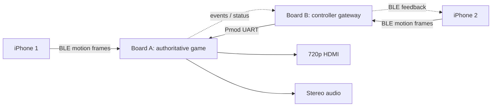

# FPGA Motion Tennis — Master Plan

## 1. Project brief

Build a two-player, motion-controlled, 2.5D tennis game using two Real Digital Boolean Boards and two iPhones.

- Each iPhone reads Core Motion data and sends controller samples over BLE to one Boolean Board.
- Board B acts as the Player 2 BLE-to-UART gateway and forwards Player 2 frames to Board A over a wired Pmod UART link.
- Board A is authoritative: it decodes both controllers, recognizes swings, advances fixed-point tennis physics, renders 1280×720 video, drives HDMI, and generates simple audio.
- The visual target is a polished retro/arcade tennis game: a perspective court, small animated sprites, a net, ball and shadow, score, connection indicators, and a swing-strength meter.

The result is not a general 3D engine and does not attempt absolute phone-position tracking. It is a responsive Wii Tennis–style experience built from motion gestures and procedurally generated 2D graphics.

## 2. Fixed decisions

| Decision | Choice |
|---|---|
| FPGA boards | Two BLE-equipped Real Digital Boolean Boards |
| FPGA | Xilinx/AMD Spartan-7 XC7S50-CSGA324 |
| HDL | Synthesizable SystemVerilog |
| Phone client | Native iPhone app using Swift, Core Motion, and Core Bluetooth |
| Player topology | One iPhone paired to each board |
| Board-to-board link | 115,200-baud full-duplex UART over Pmod GPIO |
| Main board | Board A runs all gameplay, video, scoring, and audio |
| Video target | 1280×720 at 60 Hz using the vendor VGA-to-HDMI path |
| Rendering model | One pixel per pixel clock; procedural layers plus small sprite ROMs |
| Physics | Fixed-point, updated at 60 Hz |
| Motion model | Swing classification; no double integration into absolute position |

## 3. Intended final outcome

Two players can launch the iPhone controller app, connect to their respective boards, calibrate their neutral grip, and swing their phones to serve and return a ball. The near/far avatars move automatically into plausible positions. Swing timing, direction, speed, and orientation influence the shot. Board A displays the match on an HDMI monitor and produces basic hit, bounce, fault, and score sounds.

The final handoff must include:

- Board A and Board B Vivado projects and reproducible bitstreams.
- A Swift iOS controller app that supports Player 1 and Player 2 roles.
- SystemVerilog unit tests for transport, framing, swing detection, physics, scoring, and core render predicates.
- A hardware manifest containing the verified BLE UUIDs, XDC pin assignments, Vivado/IP versions, and physical wiring.
- A short build/run guide and evidence for each key checkpoint.
- A ten-minute two-player demonstration with stable controls, correct scoring, and no visible video instability.

## 4. Scope boundaries

### Required

- Two simultaneous phone controllers through two boards.
- Robust framed sensor transport with sequence numbers and CRC.
- Stable board-to-board forwarding.
- 720p60 2.5D graphics without a full framebuffer.
- Forehand/backhand or left/right swing classification, swing strength, shot timing, ball flight, net/bounds detection, and tennis scoring.
- Basic PWM/PDM audio cues.

### Explicitly out of scope for the MVP

- Photorealistic graphics or arbitrary textured 3D polygons.
- Reconstructing the phone's absolute 3D position from acceleration.
- More than two simultaneous players.
- Reflashing or replacing the stock BLE-module firmware.
- Online multiplayer, accounts, matchmaking, or cloud services.
- A general-purpose CPU or operating system on the FPGA.

## 5. Architecture at a glance

Read [01_architecture.md](docs/01_architecture.md) for clock domains, module boundaries, interfaces, repository layout, and design rules.

## 6. Execution phases

| Phase | Purpose | Required reading | Key checkpoint |
|---|---|---|---|
| 1 | Prove iPhone motion → BLE → FPGA | [02_phase_ble_controller.md](docs/02_phase_ble_controller.md) | **C1:** Valid 50 Hz motion frames arrive for two minutes |
| 2 | Prove Board B → Board A transport | [03_phase_board_link.md](docs/03_phase_board_link.md) | **C2:** Both players arrive at Board A for five minutes |
| 3 | Establish the 720p renderer | [04_phase_video.md](docs/04_phase_video.md) | **C3:** Stable 720p60 output and timing closure |
| 4 | Implement swing/gameplay logic | [05_phase_gameplay.md](docs/05_phase_gameplay.md) | No separate hardware gate; verify in simulation and integrate incrementally |
| 5 | Integrate, tune, and package | [06_phase_integration.md](docs/06_phase_integration.md) | **C4:** Ten-minute playable two-player match |

Do not create extra formal checkpoints unless a newly discovered hardware constraint requires one. Normal unit tests and implementation milestones belong inside their phase, not in the master checkpoint list.

## 7. Coding-agent operating contract

To prevent context bloat, an implementation agent should read only:

1. This file.
2. [STATUS.md](STATUS.md).
3. [01_architecture.md](docs/01_architecture.md).
4. The single document for the current phase.

The agent should not reread completed phase documents unless a regression points back to them. At the end of each phase it must update `STATUS.md` with:

- What was implemented.
- Exact tests run and their results.
- Hardware evidence collected.
- Any discovered UUID, pin, clock, or IP information.
- Remaining risks and the next phase.

Additional rules:

- Never invent a BLE UUID, XDC pin, IP-core name, or connector orientation. Record it only after reading the vendor file or observing hardware.
- Never claim a checkpoint passed without running its specified hardware test.
- Keep hardware-specific values in `config/` or the hardware manifest, not scattered through RTL.
- Preserve clean interfaces between transport, motion interpretation, game logic, and rendering.
- Prefer parameterized, independently testable modules over a monolithic top module.
- Run simulation before synthesis and synthesis before programming hardware.
- Treat Vivado timing failures and critical warnings as failures, not informational output.

## 8. Key checkpoints

### C1 — BLE sensor path

An iPhone streams correctly framed Core Motion data at 50 Hz through the stock BLE module. The FPGA validates CRCs and exposes changing acceleration/gyro values through debug registers, ILA, LEDs, or the seven-segment display. Over two continuous minutes, at least 99.5% of sequence numbers arrive and the parser never loses permanent framing.

### C2 — two-board path

Two iPhones connect independently. Board B forwards Player 2 frames over crossed Pmod UART signals and common ground; Board A receives Player 1 directly and Player 2 through Board B. Over five minutes, each stream retains at least 99.5% of frames, CRC errors are counted, and disconnect/stale status works.

### C3 — video path

Board A drives a monitor at 1280×720/60 Hz with the vendor HDMI path. A test scene containing the perspective court, net, placeholder players, ball, font, and UI remains stable for five minutes. Implementation meets timing with non-negative worst slack and no unresolved critical warnings.

### C4 — integrated game

Two people complete a ten-minute match. Serves, hits, misses, bounds, net collisions, score transitions, reconnect/stale behavior, graphics, and audio remain coherent. Controls feel responsive on a display in Game Mode, with no recurring dropped-input bursts or visible video tearing.

## 9. Primary risks and mitigations

| Risk | Mitigation |
|---|---|
| Stock BLE behavior differs from assumptions | Discover services/characteristics first; test sustained writes before building gameplay |
| Newline inside binary data terminates a BLE-UART frame | Escape newline and escape bytes; CRC the raw payload |
| Phone acceleration drifts when integrated | Detect gestures from acceleration, gyro, and attitude; never estimate absolute position |
| Full 720p framebuffer exceeds BRAM | Generate court/UI procedurally and store only compact sprites/fonts |
| Two independent board clocks | Use asynchronous UART plus FIFO; never wire clocks together |
| Pixel/game clock crossing causes tearing | Publish an atomic game-state snapshot during vertical blank |
| Phone/TV latency makes controls feel slow | Start at 50 Hz, avoid batching, use BLE writes without response with backpressure, use display Game Mode |
| Project becomes a graphics-engine exercise | Keep perspective fixed, sprites small, palette limited, and gameplay authoritative |

## 10. Safety and wiring constraints

- Use male-to-male jumpers because the installed Pmod connectors are female sockets.
- Wire `TX → RX`, `RX → TX`, and `GND → GND`.
- Do **not** connect `3V3` or `5V` between independently USB-powered boards.
- Verify the exact Pmod pins against the official Boolean Board XDC before applying power.
- Use phone wrist straps and maintain clear space while testing swing gestures.
- Begin motion tuning with small arm movements before testing full swings.
